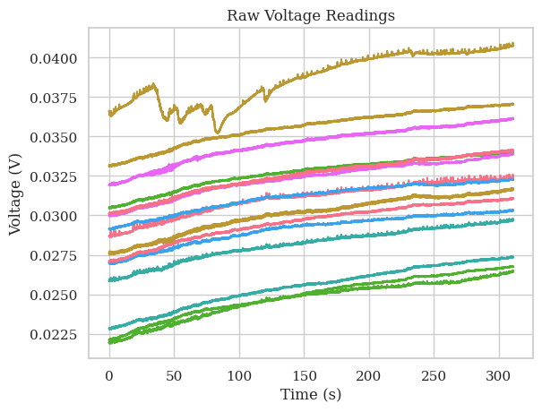
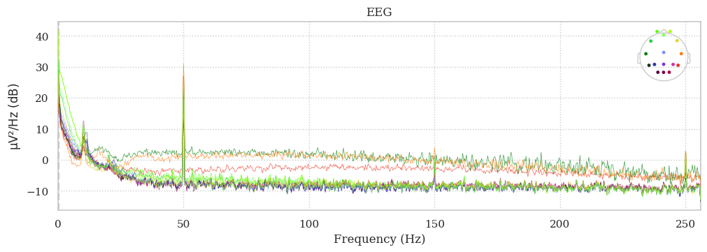
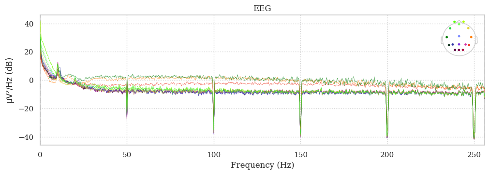
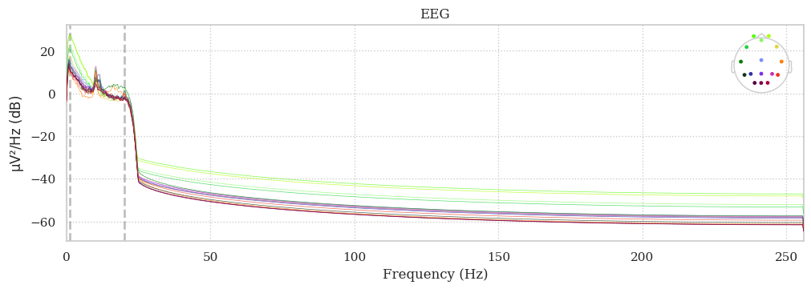
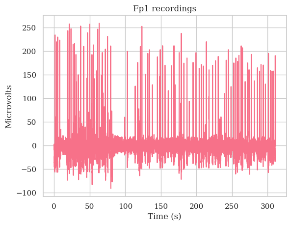
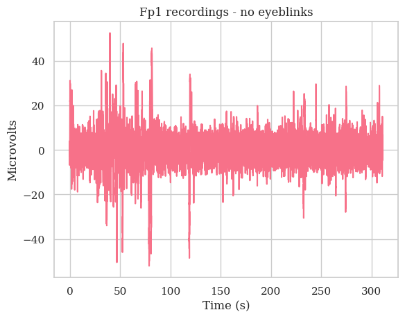
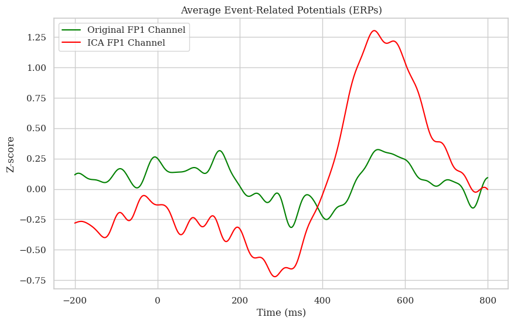

# About
Purpose: Clean up EEG data from MOABB open dataset (Aristimunha et. al, 2023) using a mix of in-built functions from the MNE library (Larson et. al, 2024) and an in-house implementation of methods (e.g. PCA) from basic Python functions (eigenvalues, eigenvectors, covariance matrix). Then, compare it with the in-built ICA from the MNE library.

## Example Visualizations
These are some examples of the visualizations created in this project
\
Fig. 1. Raw voltage data of 16 channels for 1 trial of the dataset. This depicts the EEG activity of a subject during an oddball paradigm experiment over 311s at 512Hz.

\
Fig. 2. Power spectral analysis of 1 trial. The power supply noise (50Hz) and some of its harmonics (150Hz, 250Hz) are visible here. The DC bias is less obvious from this plot, but it is the low-frequency components and causes the high voltage shift of the data seen in Fig. 1 (clean EEG data generally does not go into mV levels!).

\
Fig. 3. Power spectral analysis after bandstop filtering of power supply noise and bandpass filtering for 1-20Hz for DC bias noise.

 \
Fig. 4. Comparison of a sample channel* before eyeblink removal and after (using ICA). Note the difference in y-axis scales; eye blinks are powerful signals to the EEG compared to brain activity.

\
Fig. 5. The neural signature of a sample channel averaged over target epochs (vs. non-target = no P300 ERP). In other words, I averaged out all the epochs where there _should_ be a P300 ERP in a given trial standardized by channel. This is to compare the effect of removing eyeblink artifacts and denoising on signal-to-noise ratio.

## Code Overview
1. Grab Brain Invaders P300 paradigm (BI2013a) dataset from MOABB and explore its structure
2. Filter using MNE bandpass or bandstop methods.
3. Use PCA to filter eyeblinks
4. Compare with ICA (from MNE) to filter eyeblinks
5. Short Discussion

Terms:
1. **Event-Related Potential (ERP)**: ERPs (e.g. P300) are a category of relatively robust and commonly studied features of an EEG reading in humans that occur after an event. 
2. **P300**: an ERP with a high amplitude positive inflection occuring about 300ms from the event. One robust way to reproduce is to break a pattern (e.g. 111211 will evoke a P300 from the stimulus "2"), which is what is done in Brain Invaders P300 paradigm. (note: identifying them is a nontrivial task because they co-occur with other ERPs,)
3. **MOABB**: Mother of all BCI Benchmarks (MOABB) open dataset for lots of human neurophysiological data (https://github.com/NeuroTechX/moabb)
4. **MNE**: Magnetoencephalography aNd Electroencephalography (MNE)  popular open-source Python package for exploring, visualizing, and analyzing human neurophysiological data (MEG, EEG, etc.) (https://github.com/mne-tools/mne-python)

Sources:
- Aristimunha, B., Carrara, I., Guetschel, P., Sedlar, S., Rodrigues, P., Sosulski, J., Narayanan, D., Bjareholt, E., Quentin, B., Schirrmeister, R. T.,Kalunga, E., Darmet, L., Gregoire, C., Abdul Hussain, A., Gatti, R., Goncharenko, V., Thielen, J., Moreau, T., Roy, Y., Jayaram, V., Barachant,A., & Chevallier, S. Mother of all BCI Benchmarks (MOABB), 2023. DOI: 10.5281/zenodo.10034223.

- Larson, E., Gramfort, A., Engemann, D. A., Leppakangas, J., Brodbeck, C., Jas, M., Brooks, T., Sassenhagen, J., Luessi, M., McCloy, D., King, J.-R., Höchenberger, R., Goj, R., Favelier, G., Brunner, C., van Vliet, M., Wronkiewicz, M., Holdgraf, C., Rockhill, A., … luzpaz. (2024). MNE-Python (v1.6.1). Zenodo. https://doi.org/10.5281/zenodo.10519948
